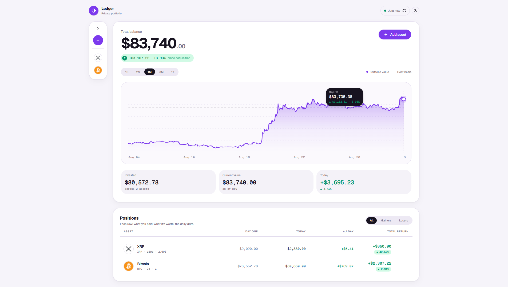
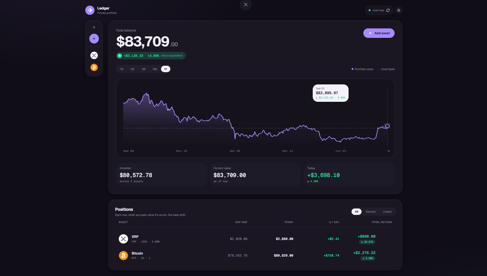

# Ledger — Private Crypto Portfolio

A local-first crypto portfolio tracker. Add your holdings, watch live prices and historical portfolio value, all kept in your browser — nothing leaves the device.

## Screenshots

### Light mode


### Dark mode


## Features

- **Portfolio overview** — total balance, gain/loss since acquisition, daily movement
- **Performance chart** — portfolio value vs. cost basis across 1D / 1W / 1M / 3M / 1Y ranges, with hover tooltip and crosshair
- **Positions table** — per-asset day-one cost, current value, daily delta, total return; filter by All / Gainers / Losers
- **Sidebar register** — search, custom sort with drag-and-drop, value-desc / value-asc sort, collapsible to icons-only rail
- **Auto price at purchase date** — pulls the market close for the selected coin + date via a 3-source cascade (CoinGecko `/history` → CoinGecko `/market_chart/range` → CryptoCompare), with a toggle to override manually
- **Light & dark theme** — soft-UI aesthetic, purple accent
- **Local persistence** — IndexedDB via Dexie, `navigator.storage.persist()` requested on boot

## Stack

- [React 19](https://react.dev) + [TypeScript](https://www.typescriptlang.org)
- [Vite](https://vite.dev) + PWA plugin
- [Tailwind CSS](https://tailwindcss.com) + [shadcn/ui](https://ui.shadcn.com) (Base UI primitives)
- [Dexie](https://dexie.org) for IndexedDB
- [SWR](https://swr.vercel.app) for price polling
- [react-day-picker](https://daypicker.dev) + [date-fns](https://date-fns.org) for the date picker
- [next-themes](https://github.com/pacocoursey/next-themes) for light/dark
- [CoinGecko](https://www.coingecko.com/en/api) + [CryptoCompare](https://min-api.cryptocompare.com/) price feeds

## Getting started

```bash
bun install
bun run dev
```

Then open <http://localhost:5173>.

## Data & privacy

All holdings are stored in the browser's IndexedDB. There is no backend, no account, no sync — clearing site data wipes it, private-mode windows keep it only for the session, and every browser/device has its own separate DB.
