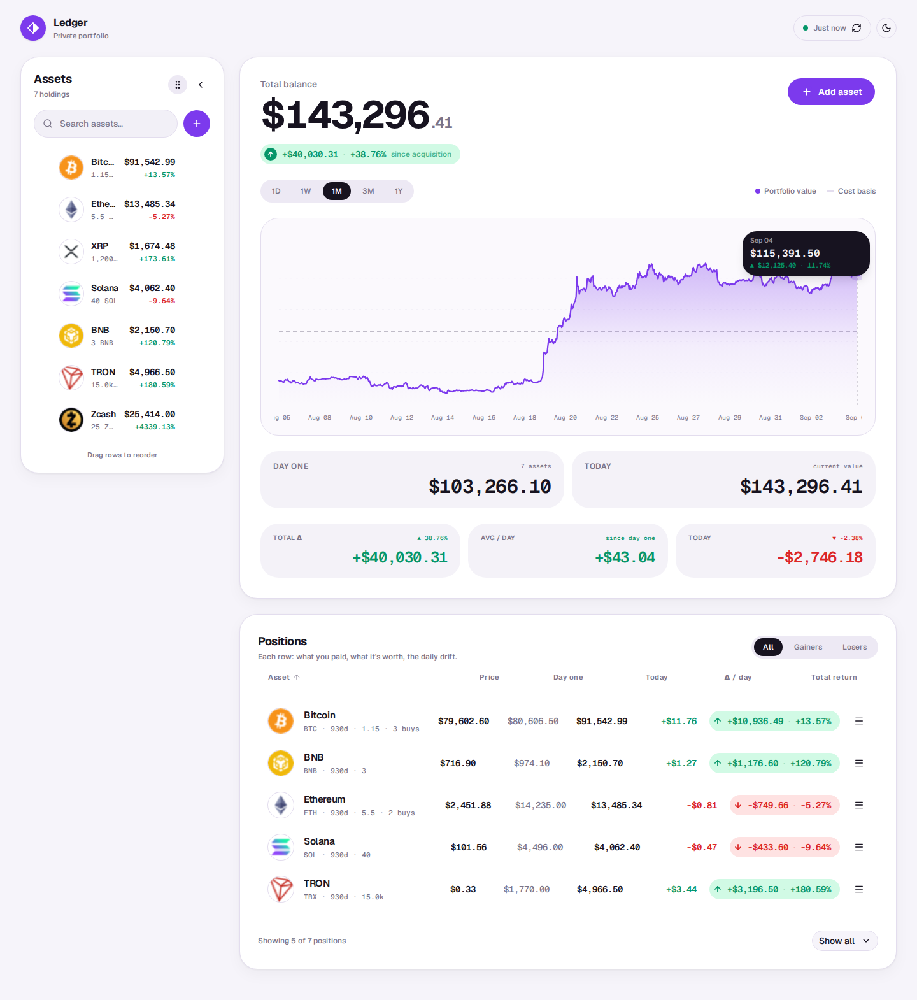
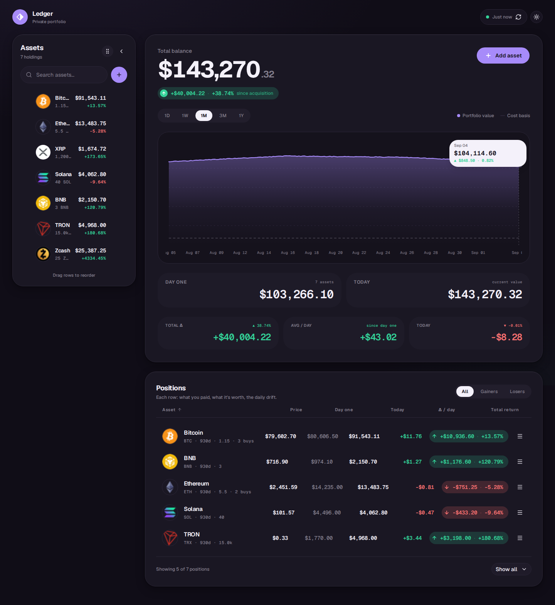
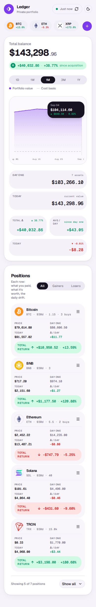
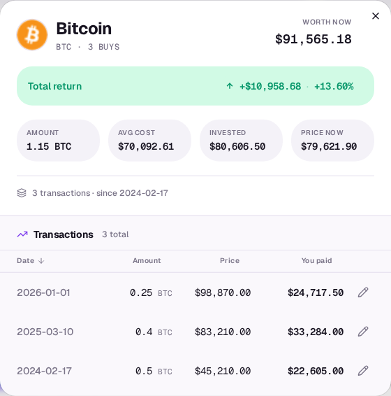

# Screenshots

Screenshots are regenerated automatically on every push to `main` via [`.github/workflows/screenshots.yml`](../.github/workflows/screenshots.yml). The build runs with a seeded portfolio (`?seed` query param) containing 10 transactions across BTC, ETH, XRP, SOL, BNB, TRX, and ZEC. Playwright captures four views.

To regenerate locally:

```bash
bun run build
bun run screenshots
```

Output lands in `screenshots/`.

---

### Desktop — light



### Desktop — dark



### Mobile — light (390 × 844)



### BTC transaction history


